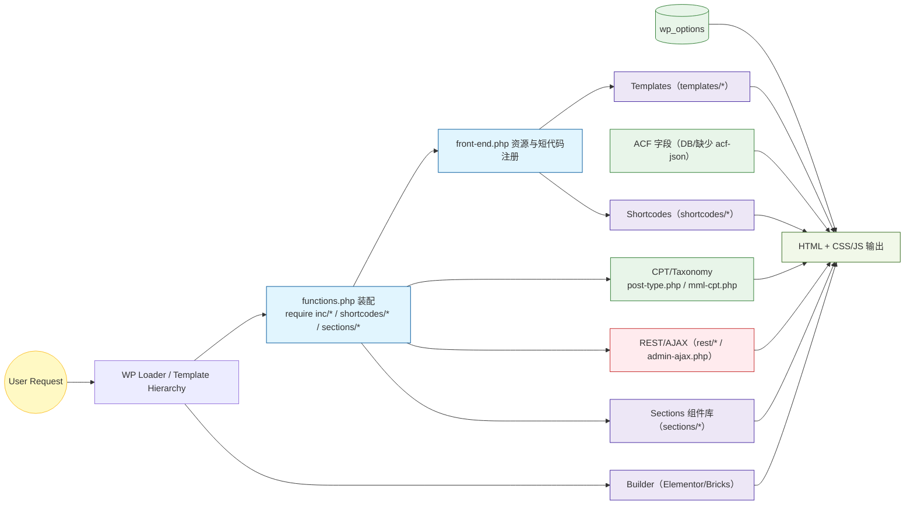

# mml-theme（7 年站点）主题代码结构审计与梳理

更新时间：2026-03-10  
范围：仅包含主题目录 `/mml-theme`；未包含正在使用的 50+ 插件代码（但会标注主题对插件的依赖点）。

---

## 1. 结论摘要（先看这个）

### 1.1 结构现状

该主题属于“长周期迭代 + 多团队并行堆叠”的典型形态：同一站点同时存在 **Bricks / Elementor / 短代码 / 自研 Section 系统** 多套渲染机制，后台侧同时存在 **自研设置页（wp_options）/ ACF（但缺少 JSON 同步落地）/ CPT（多来源）** 多套数据入口，导致：

- 业务功能分散在多个入口（`functions.php`、`inc/*`、`shortcodes/*`、`templates/*`、`sections/*`）
- 功能边界不清（管理后台、前台渲染、追踪埋点、邮件、第三方接口、REST/AJAX 混在同一层）
- 代码复用与一致性弱，难以稳定演进

### 1.2 最高优先级风险（建议立刻处理）

以下问题属于“上线后可被外部直接利用 / 持续引入风险”的级别：

- **硬编码凭证/密钥进入仓库**：`inc/ip-info.php` 中存在 MaxMind 基础认证信息（可视为泄露凭证）。  
  参考：[ip-info.php](file:///Users/javen/Desktop/Javen%20Project/mml-theme/inc/ip-info.php#L151-L173)
- **REST API 无鉴权**：`rest/spinner.php` 注册的端点 `permission_callback => __return_true`，任何人可调用修改奖品库存。  
  参考：[spinner.php](file:///Users/javen/Desktop/Javen%20Project/mml-theme/rest/spinner.php#L5-L16)
- **后台可注入任意代码片段到前台**：主题设置支持在 `<head>` / `<body>` 等位置直接输出保存的代码片段（XSS/供应链风险）。  
  参考：[theme-setup.php](file:///Users/javen/Desktop/Javen%20Project/mml-theme/inc/theme-setup.php#L106-L125)

---

## 2. 目录结构总览（按“用途”而非“文件名”理解）

> 这是理解该主题的关键：同一个“页面输出”可能来自多套系统叠加。

### 2.1 根目录（高频入口）

- `functions.php`：主题主入口，集中 `require/include` 大量模块，并注册 action/filter。  
  参考：[functions.php](file:///Users/javen/Desktop/Javen%20Project/mml-theme/functions.php)
- `front-end.php`：统一注册并 enqueue CSS/JS、注册 templates 级短代码。  
  参考：[front-end.php](file:///Users/javen/Desktop/Javen%20Project/mml-theme/front-end.php)
- `header.php / footer.php / index.php / archive.php / search.php / singular.php ...`：WP 标准模板入口（与 builder 并行存在）。
- `mml-cf7.php`：围绕 Contact Form 7 的后台配置/邮件转发逻辑（主题内实现了“类似插件”的功能）。  
  参考：[mml-cf7.php](file:///Users/javen/Desktop/Javen%20Project/mml-theme/mml-cf7.php)
- `mml-seo.php`：SEO 辅助功能（通过 meta box 选择 `templates/seo-*.php` 注入）。当前未在 `functions.php` 默认加载。  
  参考：[mml-seo.php](file:///Users/javen/Desktop/Javen%20Project/mml-theme/mml-seo.php)
- `rejson_*.php / advance-data-set.php / all-test.php / test*.php / 1.php`：大量“临时脚本/测试文件/导出工具”，属于长期遗留的维护风险点。

### 2.2 `inc/`（主题“功能模块仓库”）

`inc/` 是主题逻辑的主要堆叠区，包含：

- `theme-setup.php`：主题支持项、菜单/侧边栏注册、Theme Settings 管理后台、邮件 SMTP 设置、菜单自定义渲染等。  
  参考：[theme-setup.php](file:///Users/javen/Desktop/Javen%20Project/mml-theme/inc/theme-setup.php)
- `post-type.php`：注册 `portfolio` + `portfolio-types` 分类，并为分类加“模板选择”字段（term meta）。  
  参考：[post-type.php](file:///Users/javen/Desktop/Javen%20Project/mml-theme/inc/post-type.php)
- `mml-cpt.php`：可在后台勾选启用的 CPT 注册器（Cases/Events/Projects/...），数据存储在 `wp_options`。  
  参考：[mml-cpt.php](file:///Users/javen/Desktop/Javen%20Project/mml-theme/inc/mml-cpt.php)
- `acf-setup.php`：仅设置 ACF Local JSON 的保存/读取路径（但仓库中缺少 `acf-json/` 目录）。  
  参考：[acf-setup.php](file:///Users/javen/Desktop/Javen%20Project/mml-theme/inc/acf-setup.php)
- `elementor.php`：Elementor Pro 表单邮件过滤（Akismet 检测、IP 信息替换）并写日志。  
  参考：[elementor.php](file:///Users/javen/Desktop/Javen%20Project/mml-theme/inc/elementor.php)
- `elementor-widgets/`：自定义 Elementor Widget 注册与实现。
- `ip-info.php`：IP 地理信息获取（依赖外部服务/插件），包含硬编码认证信息。  
  参考：[ip-info.php](file:///Users/javen/Desktop/Javen%20Project/mml-theme/inc/ip-info.php)
- `catalog.php`：独立的后台 Catalog 菜单（文件链接+展示名）存储在 `wp_options`。  
  参考：[catalog.php](file:///Users/javen/Desktop/Javen%20Project/mml-theme/inc/catalog.php)
- `mml-tracking-info.php / mml-sem-cf7.php / cf7-webhook.php ...`：埋点、询盘、第三方推送等业务功能混杂在主题层。

### 2.3 `templates/`（被短代码与局部渲染复用的模板片段）

`front-end.php` 将大量模板注册为短代码，例如 `[custom_menu_1]` → `templates/custom-menu-1.php`。  
  参考：[front-end.php](file:///Users/javen/Desktop/Javen%20Project/mml-theme/front-end.php#L10-L61)

此外 `post-type.php` 允许在 Portfolio 分类上选择 `templates/` 中的某个模板作为分类模板（term meta 方式）。

### 2.4 `shortcodes/`（另一套短代码系统）

`functions.php` 直接 `require('shortcodes/_*.php')`，每个文件内部再 `add_shortcode(...)`。  
这与 `front-end.php` 的“templates → shortcode”方式并行存在，导致短代码体系重复且缺乏统一入口。

### 2.5 `sections/`（自研 Section 中台）

`functions.php` 引入：

- `sections/MML_Section_Base.php`
- `sections/MML_Section_Helper.php`
- 并提供 `mtf_section($className, $id, $style, $content)` 工厂式渲染函数

每个 Section 位于 `sections/<SectionName>/<SectionName>.php`，并常配套 `.css/.scss/.html`。  
该系统本质是“PHP 类 + 文件约定”的 UI 组件库，规模巨大（大量 `V1_*` 文件夹）。

### 2.6 资源与构建

- `src/`：源码（LESS/JS）
- `dist/`：构建产物（minified css/js + 第三方库拷贝）
- `gulpfile.js + package.json`：前端构建管线（gulp）

### 2.7 `include/`（后台 Theme Settings 页面资源）

`include/page/theme-setting.php` 使用 jQuery UI Tabs 构建后台设置界面，并直接读写 `wp_options`。  
  参考：[theme-setting.php](file:///Users/javen/Desktop/Javen%20Project/mml-theme/include/page/theme-setting.php)

---

## 3. 加载流程（从请求到输出的“主脉络”）

### 3.1 PHP 侧加载

入口：[functions.php](file:///Users/javen/Desktop/Javen%20Project/mml-theme/functions.php)

核心特点：

- 以 `require` 方式平铺引入大量文件（无 autoload、无模块边界）
- 同一个文件承担“定义 + 绑定 hook + 业务实现”多重职责
- `inc/elementor.php` 使用 `is_plugin_active()` 但未保证前台可用（存在潜在 fatal 风险）

### 3.2 前端资源加载

入口：[front-end.php](file:///Users/javen/Desktop/Javen%20Project/mml-theme/front-end.php)

- 使用 `mml_theme_fn_get_git_hash(8)` 作为静态资源版本号（依赖生产环境存在 `.git`，否则返回空字符串，缓存不可控）  
  参考：[functions.php](file:///Users/javen/Desktop/Javen%20Project/mml-theme/functions.php#L76-L88)
- `inc/theme-setup.php` 末尾用 `time()` 强制刷新某些脚本版本（导致每次请求都“破缓存”，严重影响性能与缓存命中）  
  参考：[theme-setup.php](file:///Users/javen/Desktop/Javen%20Project/mml-theme/inc/theme-setup.php#L469-L485)

---

## 4. 数据模型（主题层能看到的部分）

### 4.1 `wp_options`（主题自研设置的主要落点）

典型键：

- `mml-theme-opt-options / mml-theme-opt-blog / mml-theme-opt-code / mml-theme-opt-mail ...`（Theme Settings 表单保存）  
  参考：[theme-setup.php](file:///Users/javen/Desktop/Javen%20Project/mml-theme/inc/theme-setup.php#L76-L104)
- `mml_theme_catalog`（catalog.php 的文件链接/标题）  
  参考：[catalog.php](file:///Users/javen/Desktop/Javen%20Project/mml-theme/inc/catalog.php#L44-L50)
- `mml_theme_setting_cpt_cpt_*`（是否启用某些 CPT）  
  参考：[mml-cpt.php](file:///Users/javen/Desktop/Javen%20Project/mml-theme/inc/mml-cpt.php#L10-L41)

风险点：

- 配置项命名分散且无统一 schema，迁移/备份/同步难
- “邮件密码、注入代码”等敏感项存入 options，缺乏环境隔离与审计链路

### 4.2 CPT/Taxonomy

可明确看到的注册来源：

- `portfolio` + `portfolio-types`（固定启用）  
  参考：[post-type.php](file:///Users/javen/Desktop/Javen%20Project/mml-theme/inc/post-type.php#L3-L39)
- `Cases/Events/Projects/...`（通过后台勾选启用）  
  参考：[mml-cpt.php](file:///Users/javen/Desktop/Javen%20Project/mml-theme/inc/mml-cpt.php)

主题中还存在 Help Center 相关 CPT 的注册迹象（例如 `topic`），但其余依赖关系需要结合线上数据库与插件配置进一步确认。

### 4.3 ACF

目前主题仅做了 ACF JSON 的 save/load path 配置，但仓库中未看到 `acf-json/` 目录与字段组 JSON 文件：  
这意味着“ACF 字段结构”极可能 **只存在于数据库中**，无法通过代码回溯与版本化管理。

参考：[acf-setup.php](file:///Users/javen/Desktop/Javen%20Project/mml-theme/inc/acf-setup.php)

---

## 5. 外部依赖（主题与插件的耦合点）

主题代码中可直接识别的插件依赖：

- Elementor + Elementor Pro（表单邮件过滤、Widget）  
  参考：[elementor.php](file:///Users/javen/Desktop/Javen%20Project/mml-theme/inc/elementor.php)
- Akismet（反垃圾检查）  
  参考：[elementor.php](file:///Users/javen/Desktop/Javen%20Project/mml-theme/inc/elementor.php#L36-L90)
- Contact Form 7 + Flamingo（询盘/邮件/记录相关工具链）  
  参考：[mml-cf7.php](file:///Users/javen/Desktop/Javen%20Project/mml-theme/mml-cf7.php)
- WooCommerce（`add_theme_support('woocommerce')`）  
  参考：[theme-setup.php](file:///Users/javen/Desktop/Javen%20Project/mml-theme/inc/theme-setup.php#L20-L24)
- Bricks（存在 `templates/bricks-editor.php` 与相关资源命名）  
  参考：[templates](file:///Users/javen/Desktop/Javen%20Project/mml-theme/templates)

---

## 6. 问题清单（按“影响面”排序）

### 6.1 安全与合规

- 硬编码认证信息进入仓库（应立即替换并吊销旧凭证）：  
  [ip-info.php](file:///Users/javen/Desktop/Javen%20Project/mml-theme/inc/ip-info.php#L151-L173)
- REST API 端点无鉴权，可被任意调用修改数据：  
  [spinner.php](file:///Users/javen/Desktop/Javen%20Project/mml-theme/rest/spinner.php#L5-L16)
- Theme Settings 允许把代码注入 head/body（XSS/挂马风险）：  
  [theme-setup.php](file:///Users/javen/Desktop/Javen%20Project/mml-theme/inc/theme-setup.php#L106-L125)
- 多处外部请求使用 HTTP（明文传输，易被劫持/污染）：  
  [ip-info.php](file:///Users/javen/Desktop/Javen%20Project/mml-theme/inc/ip-info.php#L105-L142)

### 6.2 可维护性与扩展性

- `functions.php` 过载：公共工具、业务逻辑、模块装配、输出函数混在一起，任何小改动都存在连锁风险  
  [functions.php](file:///Users/javen/Desktop/Javen%20Project/mml-theme/functions.php)
- 多套渲染机制并存（短代码体系重复 + 自研 Sections + Builder）：难以建立统一的组件/数据规范
- 大量“测试/临时脚本”常驻生产主题目录：难以审计、难以升级、易误触发
- 缺少 ACF JSON 与字段组代码化：数据结构不可追踪、不可回滚、无法可靠迁移

### 6.3 性能与缓存

- 用 `time()` 强制刷新脚本版本：浏览器与 CDN 缓存基本失效  
  [theme-setup.php](file:///Users/javen/Desktop/Javen%20Project/mml-theme/inc/theme-setup.php#L469-L485)
- 依赖 `.git` 读取版本：生产环境常见为无 `.git`，导致版本号为空、缓存不可控  
  [functions.php](file:///Users/javen/Desktop/Javen%20Project/mml-theme/functions.php#L76-L88)
- 多处写日志到 uploads（且可能在高频路径触发），会带来 IO 压力与磁盘增长  
  [functions.php](file:///Users/javen/Desktop/Javen%20Project/mml-theme/functions.php#L18-L28)

### 6.4 兼容性与稳定性

- 前台直接调用 `is_plugin_active()` 但未保证函数存在（可能因环境差异导致 fatal）  
  [elementor.php](file:///Users/javen/Desktop/Javen%20Project/mml-theme/inc/elementor.php#L29-L34)

---

## 7. 建议的“整理路线图”（不改业务前提下）

> 目标：先止血（安全/稳定），再抽离（模块化），最后统一（组件/数据规范）。

### 7.1 第 0 阶段（止血：1~2 天）

- 移除仓库中的硬编码凭证并立即吊销旧凭证（MaxMind / 第三方 API）
- 给 `rest/spinner.php` 增加鉴权（nonce / token / 登录态校验）+ 增加并发安全（库存扣减的原子性）
- 关闭或限制“任意代码注入”选项，至少做白名单与权限隔离，并对输出进行最小化约束

### 7.2 第 1 阶段（模块边界：3~7 天）

- 把 `functions.php` 重构为“bootstrap + modules”模式（仅装配，不放业务实现）
- 将“主题层实现的插件型功能”（CF7/Tracking/Webhook/SEO）迁移为 **独立插件或 mu-plugin**，降低主题升级风险
- 将 `wp_options` 配置建立 schema（统一 key 前缀、字段含义、默认值、迁移脚本）

### 7.3 第 2 阶段（数据结构可版本化：3~10 天）

- 补齐 `acf-json/` 并把 ACF 字段组纳入版本控制（或改为 `acf_add_local_field_group` 代码化）
- 统一命名与字段规范（避免同名冲突、便于前端扁平读取）

### 7.4 第 3 阶段（前端渲染统一：持续迭代）

- 明确“主渲染系统”选择（Bricks 或 Elementor 或自研 Sections），其余逐步迁移/淘汰
- 把 `sections/` 组件库按业务域拆分，并建立可复用的参数 schema 与数据来源

---

## 8. 下一步我建议的落地动作（基于你当前目标）

如果你的目标是“先把结构弄清楚，然后能安全迭代”，我建议下一步按优先级做两件事：

1) 先做一次“安全止血 PR”（凭证/REST/注入点/HTTP 外部请求）  
2) 生成一份“线上现状盘点表”（CPT/Taxonomy/ACF Field Groups/Options Key/关键插件清单），用于后续迁移与重构

---

## 9. 模块清单与职责映射（主题内）

> 目的：明确“谁负责什么”，为后续瘦身与模块迁移做输入。

- 核心装配
  - functions.php：装配入口、注册 hooks、引入 inc/*、短代码、REST、Sections
  - front-end.php：统一注册/加载 CSS/JS，注册基于 templates 的短代码
- 后台设置与装配
  - inc/theme-setup.php：主题支持项、Theme Settings 菜单与保存、菜单渲染、自定义输出（head/body）
  - include/page/theme-setting.php：设置页 UI（jQuery UI Tabs），写入 wp_options
  - inc/catalog.php：Catalog 独立设置页（文件链接/展示名）
- 内容模型
  - inc/post-type.php：portfolio + portfolio-types；分类模板选择（term meta）
  - inc/mml-cpt.php：可选启用的 CPT 注册器（Cases/Events/Projects/...）
- ACF
  - inc/acf-setup.php：配置 ACF Local JSON 读写路径（但当前仓库缺少 acf-json 内容）
- 页面渲染体系（并存）
  - templates/*：被 front-end.php 注册为短代码使用的碎片模板
  - shortcodes/*：独立注册的短代码（与 templates 体系重复）
  - sections/*：自研 Section 组件库（PHP 类 + 约定路径），通过 mtf_section 渲染
  - Bricks/Elementor：存在集成与 Widget；部分页面可能完全由 Builder 渲染
- 运营与集成
  - inc/elementor.php：Elementor Pro 表单邮件内容过滤（Akismet、IP 信息）
  - mml-cf7.php：围绕 CF7 的运营工具与邮件处理
  - inc/mml-sem-cf7.php / inc/mml-flamingo-tool.php / inc/mml-alt-tool.php：与询盘/埋点/图片替换相关的辅助
  - rest/spinner.php：活动类 REST 接口（无鉴权）
  - inc/ip-info.php：IP 归属地查询（多来源）

---

## 10. 冗余与候选删除项（主题视角的初筛）

> 原则：不着急删除，先“标签化”。后续通过“灰度下线 → 回归”验证再处理。

- 长期遗留的临时/测试脚本：`rejson_*.php / advance-data-set.php / all-test.php / test*.php / 1.php`
  - 标签：疑似一次性工具；生产环境常驻有风险
  - 动作：归档到 `tools/` 或迁出主题；上线前排除加载路径；仅在本地/CI 使用
- 短代码体系重复：
  - `front-end.php` 基于 templates 的短代码 与 `shortcodes/*` 并存
  - 标签：功能重叠
  - 动作：建立短代码清单 → 标注调用点 → 选定“唯一入口”（优先 templates 方式）→ 重定向/合并
- 前端缓存失效逻辑：
  - `inc/theme-setup.php` 使用 `time()` 强推版本
  - 标签：性能风险
  - 动作：改为“固定版本号 + 构建产物 hash”；逐步移除 `time()` 强刷
- 直接写入 uploads 的日志：
  - `functions.php:mml_log()`、`inc/elementor.php` 日志
  - 标签：IO/磁盘风险
  - 动作：统一日志策略（按环境级别/大小轮转/关闭），或使用专用日志插件/服务
- 直接在主题内实现插件型功能：
  - `mml-cf7.php`、`rest/spinner.php`、`inc/ip-info.php` 等
  - 标签：边界不清、升级风险高
  - 动作：迁移到 `mu-plugins/` 或独立插件（便于单独启停与版本化）

---

## 11. 插件审计清单模板（用于逐个评估 50+ 插件）

> 方法：逐个插件建立以下条目；每条用“证据”反向定位到模板/短代码/Widget/REST/DB 使用点。

- 基本信息
  - 插件名 / 版本 / 来源（商业/自研） / 最近更新时间
  - 依赖关系（与其他插件/主题的耦合）
- 使用证据
  - 模板/短代码/小工具调用点（文件/函数/短代码名/Widget 名）
  - 自定义 Post Type/Taxonomy/Options/ACF 字段（是否仅插件提供）
  - REST 路由 / AJAX action / Cron 任务
  - 数据库存储（自建表/option 前缀/postmeta key 前缀）
- 风险评估
  - 安全：公开端点、权限校验、敏感数据
  - 性能：前端资源体积、页面/查询开销
  - 维护：活跃度、兼容性
- 下线可行性
  - 功能替代方案（主题内/其他插件）
  - 灰度方案与回归点（页面/表单/接口/SEO）
  - 下线步骤（停用 → 垃圾数据清理 → 资源移除）

执行步骤建议：
- 导出当前生效短代码清单：搜索 `add_shortcode` 与内容中使用的 `[`...`]`
- 枚举 REST：搜索 `register_rest_route` / `admin-ajax.php` Action
- 查找插件特征：函数前缀、类名、静态资源句柄（wp_enqueue_*）、数据库前缀（options/meta keys）

---

## 12. 架构总览（Mermaid）

> 说明：左→右展示“请求 → 装配/数据 → 渲染 → 输出”的路径，便于后续统一渲染与模块拆分。

---

## 13. 稳妥推进节奏（不着急，分阶段交付）

- 第 1 周：补完“模块清单 + 插件审计模板”，并标注 10 个优先模块的职责与风险
- 第 2 周：完成“安全止血 PR”，并对短代码体系进行“只读清点 + 路由图”
- 第 3~4 周：确定主渲染体系；为 3 个高频页面建立“单一渲染路径”试点（去重短代码/sections）
- 持续：把 ACF 字段组拉回版本控制（acf-json 或 `acf_add_local_field_group`），建立“字段命名与扁平化约定”
